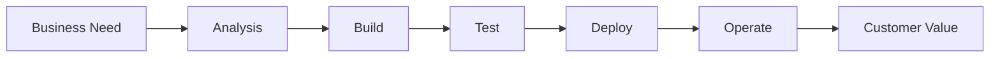
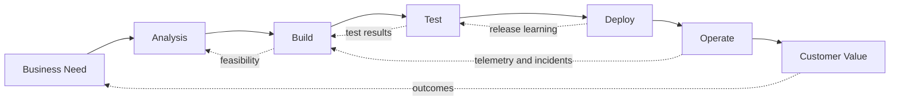
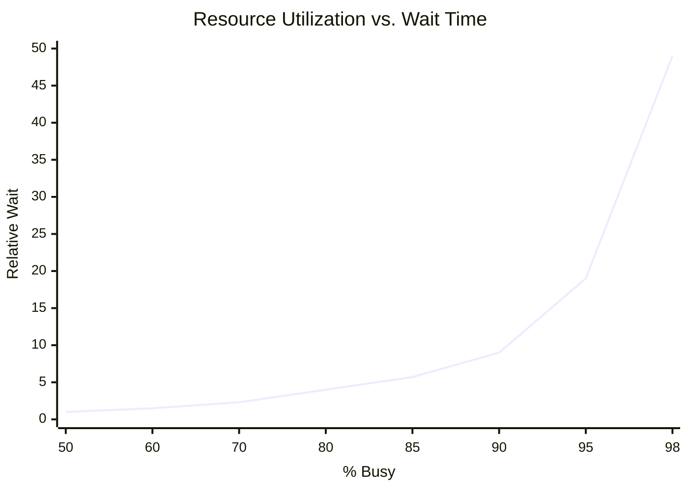
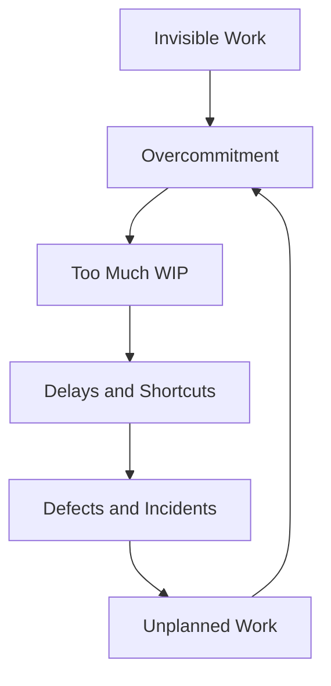
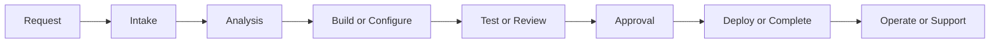
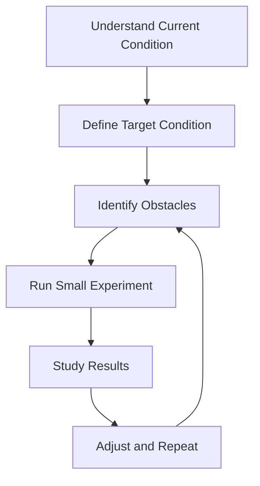

# The Phoenix Project Participant Lesson Book v3.0

## A 4-Week Study Guide for Applying DevOps, Flow, Feedback, and Continuous Learning

**Book:** *The Phoenix Project: A Novel About IT, DevOps, and Helping Your Business Win* by Gene Kim, Kevin Behr, and George Spafford  
**Companion Reference:** *The Phoenix Project Resource Guide*  
**Format:** Four weekly 60-minute brown-bag sessions  
**Audience:** Project Managers, Product Owners, Developers, Business Analysts, Operations, Security, QA, Support, and Leaders  
**Participant Outcome:** Read the assigned chapters, connect the story to your role, and create one practical 30-day improvement proposal.

---

## How This Lesson Book Is Different

This version is designed to read and function more like a real participant workbook. Instead of only listing questions, each week now includes:

- A short lesson narrative.
- Learning objectives.
- Reading guidance.
- Key vocabulary.
- Concept notes.
- Guided activities.
- Role-based application prompts.
- Reflection space.
- Weekly deliverables.
- A final 30-day improvement proposal template.

You are not expected to become a DevOps expert in four weeks. The goal is to learn how to see work differently: as a system of flow, constraints, feedback, learning, and business outcomes.

---

## Printable Workbook Use

**Participant Name:** ________________________________________________

**Team / Role:** _____________________________________________________

**Cohort / Session Dates:** __________________________________________

This version includes lined writing space for printed use. Use the blank lines to capture reading notes, discussion responses, role connections, and weekly assignments. Short answers are enough; the goal is to bring your observations to the weekly discussion.

---

# Part 1: Course Orientation

## Why We Are Reading This Book

*The Phoenix Project* is a business novel about IT, but it is really about how organizations work. The story shows how invisible work, poor handoffs, overloaded experts, unclear priorities, late security involvement, and constant firefighting can damage business performance.

The lesson is not simply “IT should work harder.” Most people in the story are already working hard. The deeper lesson is this:

> A broken system can make smart, hardworking people look ineffective.

This guide will help you connect the story to your own role and organization.

## What You Will Practice

Across the four weeks, you will practice four skills:

1. **Seeing work:** identifying visible and invisible demand.
2. **Seeing flow:** noticing where work waits, gets blocked, or gets reworked.
3. **Seeing feedback:** noticing where problems are discovered too late.
4. **Seeing improvement:** designing a small 30-day experiment instead of waiting for a massive transformation.

## Weekly Reading Plan

| Week | Reading Assignment | Lesson Theme | Participant Output |
|---|---:|---|---|
| Week 1 | Chapters 1-10 | The mess, silos, invisible work, and the Four Types of Work | Work visibility reflection |
| Week 2 | Chapters 11-20 | The First Way, constraints, WIP, queue time, and Kanban | Flow map and bottleneck analysis |
| Week 3 | Chapters 21-29 | The Second Way, feedback loops, quality, and security | Feedback loop worksheet |
| Week 4 | Chapters 30-35 | The Third Way, learning, resilience, and business alignment | 30-day improvement proposal |

---

# Part 2: Core Ideas You Will Use Every Week

## Lesson 1: DevOps Is a Business Capability

DevOps is often misunderstood as automation, deployment tooling, or engineers using modern pipelines. Those can be part of it, but they are not the whole point.

In this study, treat DevOps as an organizational capability that helps business needs move safely and quickly into customer value.

DevOps improves:

- Speed of delivery.
- Reliability and availability.
- Recovery from incidents.
- Security and compliance integration.
- Employee productivity and morale.
- Customer responsiveness.
- Ability to learn from real outcomes.

### Reflection

In your organization, is technology treated mostly as:

- A cost center?
- A service provider?
- A business partner?
- A product and value-creation capability?

Write your response:

______________________________________________________________________________

______________________________________________________________________________

______________________________________________________________________________

---

## Lesson 2: The Three Ways

The Three Ways are the central learning model for this course.

### The First Way: Flow

The First Way focuses on how work moves from business need to customer value.

A healthy flow of work has fewer delays, fewer hidden queues, smaller batches, fewer handoffs, and less rework.

### The Second Way: Feedback

The Second Way focuses on how information moves backward through the system so teams can learn sooner.

A healthy feedback system catches problems early, not after customers, auditors, or executives discover them.

### The Third Way: Continual Learning and Experimentation

The Third Way focuses on building a culture where teams improve the system, practice recovery, and learn from failure.

A learning organization makes improvement part of daily work instead of treating it as extra work.

---

## Lesson 3: The Four Types of Work

The book describes four types of IT work. You will use this model throughout the course.

| Type of Work | What It Means | Why It Matters |
|---|---|---|
| Business Projects | Work tied to strategic initiatives, products, revenue, or business goals | Usually visible to leadership, but often depends on hidden technical work |
| Internal IT Projects | Infrastructure, modernization, automation, tooling, resilience, cleanup | Often underfunded or invisible but required for stability and delivery |
| Changes | Releases, configuration updates, access changes, system modifications | Can create incidents when poorly understood or rushed |
| Unplanned Work | Incidents, outages, escalations, emergency fixes, rework | Consumes capacity and prevents planned work from finishing |

### Practice

Think about your last two weeks of work. List five work items and classify each one.

| Work Item | Type of Work | Planned or Unplanned? | Who Requested It? | Who Was Impacted? |
|---|---|---|---|---|
|  |  |  |  |  |
|  |  |  |  |  |
|  |  |  |  |  |
|  |  |  |  |  |
|  |  |  |  |  |

---

## Lesson 4: WIP, Queue Time, and Overloaded People

A key lesson from the Resource Guide is that high utilization creates long wait times. When people or teams are loaded near 100%, work does not flow faster. It waits longer.

> A 30-minute task can take two weeks if it waits behind several overloaded teams.

### Reflection

Where does small work wait too long in your organization?

______________________________________________________________________________

______________________________________________________________________________

______________________________________________________________________________

---

# Week 1 Lesson: The Mess and the Four Types of Work

## Reading Assignment

Read **Chapters 1-10**.

## Lesson Overview

Bill Palmer is pushed into the VP of IT Operations role at Parts Unlimited. The business is under pressure, Project Phoenix is failing, teams are siloed, and urgent work is everywhere. Week 1 is about learning to see the mess clearly without immediately blaming people.

## Learning Objectives

By the end of this lesson, you should be able to:

- Identify symptoms of a broken work system.
- Explain the Four Types of Work.
- Describe how unplanned work damages planned work.
- Recognize hero culture and single points of failure.
- Connect one example from the book to your own role.

## Key Vocabulary

| Term | Meaning |
|---|---|
| Invisible Work | Work that consumes capacity but is not shown in official plans or dashboards |
| Unplanned Work | Emergency or recovery work that displaces planned commitments |
| Hero Culture | A pattern where the organization depends on heroic individuals instead of reliable systems |
| Silo | A team or function optimized around its own goals instead of the whole system |
| Business Value | A result that improves customer, operational, financial, risk, or strategic outcomes |

## Before You Read

As you read Chapters 1-10, mark scenes where:

- People are reacting instead of planning.
- Work bypasses normal process.
- Different teams blame one another.
- A single person becomes necessary for too many things.
- Leaders cannot see the real work happening under the surface.

## Reading Questions

1. What are the earliest signs that Parts Unlimited has a system problem, not just a project problem?

   ____________________________________________________________________________

   ____________________________________________________________________________

2. Why does Bill resist the promotion?

   ____________________________________________________________________________

   ____________________________________________________________________________

3. What work is visible to executives?

   ____________________________________________________________________________

   ____________________________________________________________________________

4. What work is invisible but still consuming capacity?

   ____________________________________________________________________________

   ____________________________________________________________________________

5. What is Project Phoenix expected to accomplish for the business?

   ____________________________________________________________________________

   ____________________________________________________________________________

6. What happens when standard IT processes are bypassed?

   ____________________________________________________________________________

   ____________________________________________________________________________

7. Who appears overloaded, and what makes that dangerous?

   ____________________________________________________________________________

   ____________________________________________________________________________

## Lesson Notes

The first part of the book shows a familiar enterprise pattern: everyone is busy, but the organization still cannot reliably deliver. That means effort is not the core issue. The system of work is the issue.

When work is invisible, leaders overcommit teams. When priorities are unclear, everything becomes urgent. When everything is urgent, people bypass process. When process is bypassed, quality and reliability suffer. When reliability suffers, unplanned work grows. This creates a loop.

## In-Session Activity: Make Work Visible

Use the table below to classify real or realistic work from your role.

| Work Item | Business Project | Internal IT Project | Change | Unplanned Work | Notes |
|---|---:|---:|---:|---:|---|
|  |  |  |  |  |  |
|  |  |  |  |  |  |
|  |  |  |  |  |  |
|  |  |  |  |  |  |

## Role Application

### Project Manager

Where does unplanned work disrupt your schedule? What work is missing from your plan but still consumes team capacity?

______________________________________________________________________________

______________________________________________________________________________

### Product Owner

Are priorities truly ranked, or are many items treated as equally urgent? What should be stopped or delayed?

______________________________________________________________________________

______________________________________________________________________________

### Developer

What interrupts focused work? Where are heroics rewarded more than prevention?

______________________________________________________________________________

______________________________________________________________________________

### Business Analyst

Where do unclear requirements create downstream rework? Who should be involved earlier?

______________________________________________________________________________

______________________________________________________________________________

### Operations / Infrastructure

What work arrives late and urgent? Which recurring tasks should become standardized or automated?

______________________________________________________________________________

______________________________________________________________________________

### Security / Risk / Compliance

Where are controls discovered too late? What risks are created by emergency delivery?

______________________________________________________________________________

______________________________________________________________________________

### Leader / Manager

What work is invisible in status reporting? Who are the single points of failure?

______________________________________________________________________________

______________________________________________________________________________

## Week 1 Reflection Assignment

Write a one-page reflection:

> Where does my organization rely on heroics instead of reliable systems?

Include:

1. A real or realistic example.
2. The type of work involved.
3. The impact on delivery, risk, quality, or morale.
4. One way to make the work more visible.

### Draft Reflection Space

______________________________________________________________________________

______________________________________________________________________________

______________________________________________________________________________

______________________________________________________________________________

______________________________________________________________________________

______________________________________________________________________________

---

# Week 2 Lesson: The First Way, Constraints, WIP, and Kanban

## Reading Assignment

Read **Chapters 11-20**.

## Lesson Overview

Bill begins applying manufacturing and Lean principles to IT work. The team learns that the problem is not simply lack of effort. Work is stuck in queues, flowing through bottlenecks, and depending too heavily on Brent.

## Learning Objectives

By the end of this lesson, you should be able to:

- Explain the First Way: Flow.
- Describe the Theory of Constraints.
- Identify a bottleneck in a workflow.
- Explain why high utilization increases wait time.
- Use a simple Kanban model to visualize work.

## Key Vocabulary

| Term | Meaning |
|---|---|
| Constraint | The person, team, system, process, vendor, or approval that limits total throughput |
| WIP | Work in progress; work started but not finished |
| Queue Time | Time work spends waiting before being acted on |
| Kanban | A visual method for managing work and limiting WIP |
| Local Optimization | Improving one team’s metric while harming the larger system |

## Theory of Constraints: Five Steps

1. **Identify** the constraint.
2. **Exploit** the constraint by ensuring it works only on the highest-value work only it can do.
3. **Subordinate** other work to the constraint.
4. **Elevate** the constraint by increasing capacity or reducing demand.
5. **Repeat** because the constraint will move.

## Before You Read

As you read Chapters 11-20, look for:

- Where work queues up.
- Who everyone waits for.
- What work should not be going to Brent.
- How visualizing work changes conversations.
- How limiting WIP changes behavior.

## Reading Questions

1. What does Erik teach Bill about constraints?

   ____________________________________________________________________________

   ____________________________________________________________________________

2. Why is Brent a bottleneck?

   ____________________________________________________________________________

   ____________________________________________________________________________

3. What kinds of work should be protected from Brent?

   ____________________________________________________________________________

   ____________________________________________________________________________

4. How does the Kanban board change the conversation?

   ____________________________________________________________________________

   ____________________________________________________________________________

5. What happens when all work must flow through one expert?

   ____________________________________________________________________________

   ____________________________________________________________________________

6. How does high utilization create long queues?

   ____________________________________________________________________________

   ____________________________________________________________________________

7. What would it mean to optimize the whole system instead of one team?

   ____________________________________________________________________________

   ____________________________________________________________________________

## Lesson Notes

The First Way is about flow from business need to customer value. If one part of the system is overloaded, the whole system slows down. Work does not flow just because people are busy.

A bottleneck can be a person, but it can also be:

- A manual approval board.
- An environment.
- A vendor.
- A security review queue.
- A test cycle.
- A release process.
- A product owner decision.
- A shared specialist.

## In-Session Activity: Flow Map

Choose one process from your role. Map how it moves from request to outcome.

| Step | What Happens? | Who Owns It? | Where Does It Wait? | What Can Go Wrong? |
|---|---|---|---|---|
| 1 |  |  |  |  |
| 2 |  |  |  |  |
| 3 |  |  |  |  |
| 4 |  |  |  |  |
| 5 |  |  |  |  |

## Role Application

### Project Manager

What dependency most often delays your project? Is it visible in the plan?

______________________________________________________________________________

______________________________________________________________________________

### Product Owner

What work should be deprioritized so the most important work can finish?

______________________________________________________________________________

______________________________________________________________________________

### Developer

What creates the most waiting time before you can complete work?

______________________________________________________________________________

______________________________________________________________________________

### Business Analyst

Where do requirements wait for clarification or decision-making?

______________________________________________________________________________

______________________________________________________________________________

### Operations / Infrastructure

Which recurring requests should become self-service or automated?

______________________________________________________________________________

______________________________________________________________________________

### Security / Risk / Compliance

Which controls can become standardized patterns instead of one-off reviews?

______________________________________________________________________________

______________________________________________________________________________

### Leader / Manager

What work needs to stop so the most important work can finish?

______________________________________________________________________________

______________________________________________________________________________

## Week 2 Deliverable

Create a simple flow map for one process in your role. Identify:

1. Start point.
2. End point.
3. Major handoffs.
4. Waiting points.
5. Bottlenecks.
6. One improvement idea.

---

# Week 3 Lesson: The Second Way, Feedback, Quality, and Security

## Reading Assignment

Read **Chapters 21-29**.

## Lesson Overview

The organization begins to improve feedback. Development and Operations start collaborating more effectively. Security begins shifting from late-stage gatekeeping toward earlier enablement. Work becomes safer when feedback becomes faster.

## Learning Objectives

By the end of this lesson, you should be able to:

- Explain the Second Way: Feedback.
- Identify a delayed feedback loop.
- Explain why late feedback creates rework.
- Describe quality at the source.
- Explain how Security can become an enabler.

## Key Vocabulary

| Term | Meaning |
|---|---|
| Feedback Loop | A mechanism that tells earlier teams whether work is safe, useful, correct, or valuable |
| Quality at the Source | Building quality into the work instead of inspecting it only at the end |
| Shift Left | Moving quality, security, operational, and risk input earlier in the lifecycle |
| Batch Size | The amount of work released or reviewed at once |
| Shared Pain | Teams jointly owning the consequences of system outcomes |

## Before You Read

As you read Chapters 21-29, look for:

- Where teams begin sharing information sooner.
- Where smaller batches reduce risk.
- Where security changes its approach.
- Where quality becomes built into work rather than inspected afterward.
- Where feedback changes behavior.

## Reading Questions

1. What is the core idea of the Second Way?

   ____________________________________________________________________________

   ____________________________________________________________________________

2. How do Chris and Bill begin to align their goals?

   ____________________________________________________________________________

   ____________________________________________________________________________

3. Why are smaller batches safer than large deployments?

   ____________________________________________________________________________

   ____________________________________________________________________________

4. How does John, the CISO, begin to change?

   ____________________________________________________________________________

   ____________________________________________________________________________

5. What feedback was missing earlier?

   ____________________________________________________________________________

   ____________________________________________________________________________

6. Where did teams previously learn too late?

   ____________________________________________________________________________

   ____________________________________________________________________________

7. What changes make work safer?

   ____________________________________________________________________________

   ____________________________________________________________________________

## Lesson Notes

Late feedback is expensive. If a requirement is wrong, it is cheaper to learn that during analysis than after deployment. If a security control is missing, it is cheaper to learn during design than during audit. If a system cannot be operated, it is cheaper to learn before production.

Good feedback is not just more meetings. It can be:

- Automated test results.
- Build status.
- Production telemetry.
- Security patterns.
- Peer review.
- Customer usage data.
- Support trends.
- Incident reviews.
- Acceptance criteria.
- Release readiness checks.

## In-Session Activity: Feedback Loop Review

| Question | Response |
|---|---|
| What process are you reviewing? |  |
| Where do problems usually start? |  |
| Where are they discovered? |  |
| Who receives the feedback? |  |
| Who should receive the feedback earlier? |  |
| What feedback is too slow? |  |
| What can be automated, standardized, or made visible? |  |

## Role Application

### Project Manager

Where should feedback checkpoints be added to the plan?

______________________________________________________________________________

______________________________________________________________________________

### Product Owner

How do you know whether a feature solved the business problem?

______________________________________________________________________________

______________________________________________________________________________

### Developer

What test, review, or telemetry would catch issues earlier?

______________________________________________________________________________

______________________________________________________________________________

### Business Analyst

What requirement questions would prevent downstream rework?

______________________________________________________________________________

______________________________________________________________________________

### Operations / Infrastructure

What production signals should feed back into design and planning?

______________________________________________________________________________

______________________________________________________________________________

### Security / Risk / Compliance

What controls can become templates, patterns, or automated checks?

______________________________________________________________________________

______________________________________________________________________________

### QA / Testing

Which defect pattern keeps repeating?

______________________________________________________________________________

______________________________________________________________________________

### Support

Which recurring tickets should influence product or engineering priorities?

______________________________________________________________________________

______________________________________________________________________________

## Week 3 Deliverable

Write a one-page response:

> What problem in my role do we usually discover too late?

Include:

1. Where the problem starts.
2. Where it is discovered.
3. Why feedback is delayed.
4. What earlier feedback loop could help.

### Draft Feedback Reflection Space

Problem discovered too late: _________________________________________________

Where it starts: ______________________________________________________________

Where it is discovered: _______________________________________________________

Why feedback is delayed: ______________________________________________________

Earlier feedback loop: ________________________________________________________

Notes:

______________________________________________________________________________

______________________________________________________________________________

---

# Week 4 Lesson: The Third Way, Learning, Resilience, and Business Alignment

## Reading Assignment

Read **Chapters 30-35**.

## Lesson Overview

The organization begins to improve the system of work. IT becomes more connected to business outcomes. Teams practice resilience, learn from failure, and begin treating improvement as part of daily work.

## Learning Objectives

By the end of this lesson, you should be able to:

- Explain the Third Way.
- Describe how practice and repetition build mastery.
- Connect DevOps principles to business outcomes.
- Explain why nonfunctional requirements are business requirements.
- Create a realistic 30-day improvement proposal.

## Key Vocabulary

| Term | Meaning |
|---|---|
| Blameless Postmortem | A review focused on learning from system conditions, not punishing individuals |
| Resilience | The ability to continue or recover when things fail |
| Toyota Kata | A repeated improvement routine based on current condition, target condition, obstacles, experiments, and learning |
| Nonfunctional Requirement | Requirements such as reliability, security, scalability, operability, maintainability, and recoverability |
| 30-Day Experiment | A small improvement that can be tested quickly and measured simply |

## Improvement Kata

## Before You Read

As you read Chapters 30-35, look for:

- How leaders change their view of IT.
- How teams practice recovery.
- How work becomes aligned to business value.
- What behaviors show learning.
- What changes make the system more resilient.

## Reading Questions

1. What does the Third Way require from culture?

   ____________________________________________________________________________

   ____________________________________________________________________________

2. What is the purpose of the Chaos Monkey-style exercise?

   ____________________________________________________________________________

   ____________________________________________________________________________

3. How does Steve Masters’ view of IT change?

   ____________________________________________________________________________

   ____________________________________________________________________________

4. How does the team save Project Phoenix?

   ____________________________________________________________________________

   ____________________________________________________________________________

5. What behaviors show that the organization is learning?

   ____________________________________________________________________________

   ____________________________________________________________________________

6. What nonfunctional requirements become more important?

   ____________________________________________________________________________

   ____________________________________________________________________________

7. How does IT become a business partner instead of a scapegoat?

   ____________________________________________________________________________

   ____________________________________________________________________________

## Lesson Notes

The Third Way is about creating conditions where learning is normal. Teams cannot improve if every failure leads to blame, if every person is fully utilized, or if improvement is treated as extra work.

A learning organization asks:

- What did we expect to happen?
- What actually happened?
- What surprised us?
- What did the system make easy or hard?
- What should we try next?

## In-Session Activity: 30-Day Improvement Proposal

| Area | Response |
|---|---|
| My role |  |
| Recurring problem |  |
| Book concept |  |
| Root cause or system condition |  |
| People impacted |  |
| 30-day experiment |  |
| Support needed |  |
| Success measure |  |

## Week 4 Deliverable

Create a **Phoenix Project Role Application Brief**.

Length: 1-2 pages.

Include:

1. Your role.
2. Three lessons from the book.
3. One problem in your organization that reflects the book.
4. One bottleneck or source of unplanned work.
5. One feedback loop that needs improvement.
6. One action you can personally take.
7. One recommendation for leadership.

### Draft Role Application Brief

My role: _____________________________________________________________________

Lesson 1: ____________________________________________________________________

Lesson 2: ____________________________________________________________________

Lesson 3: ____________________________________________________________________

Problem that reflects the book: _______________________________________________

Bottleneck / unplanned work source: ___________________________________________

Feedback loop to improve: _____________________________________________________

Action I can take: ____________________________________________________________

Leadership recommendation: ___________________________________________________

Notes:

______________________________________________________________________________

______________________________________________________________________________

---

# Final Capstone: 30-Day Improvement Proposal

Your final output is a short proposal for one practical improvement.

## Proposal Template

### 1. Problem Statement

Describe one recurring problem that affects flow, quality, risk, reliability, morale, or delivery.

> 

### 2. Current Impact

Explain how the problem affects time, cost, quality, morale, customer experience, or risk.

> 

### 3. Book Connection

Identify the related lesson from *The Phoenix Project*.

Possible connections:

- Four Types of Work.
- Unplanned work.
- Brent bottleneck.
- First Way: Flow.
- Second Way: Feedback.
- Third Way: Learning.
- Theory of Constraints.
- WIP limits.
- Security shifting left.
- Continuous delivery.
- Toyota Kata.

> 

### 4. Root Cause or System Condition

Explain why the issue keeps happening.

> 

### 5. Proposed 30-Day Experiment

Describe one small, realistic change that can be tested in 30 days.

> 

### 6. Expected Outcome

Explain what should improve.

> 

### 7. Measurement

Pick one or two simple indicators.

Examples:

- Fewer emergency requests.
- Reduced approval wait time.
- Fewer reopened defects.
- Faster incident recovery.
- Reduced blocked work.
- More work visible in the backlog.
- Fewer late security findings.
- Improved deployment success.

> 

---

# Final Reflection

Answer these questions after the final session.

1. What part of the book felt most familiar?

   ____________________________________________________________________________

   ____________________________________________________________________________

2. Who or what is the “Brent” in your organization?

   ____________________________________________________________________________

   ____________________________________________________________________________

3. What type of unplanned work consumes the most time?

   ____________________________________________________________________________

   ____________________________________________________________________________

4. Where is there too much WIP?

   ____________________________________________________________________________

   ____________________________________________________________________________

5. What is discovered too late?

   ____________________________________________________________________________

   ____________________________________________________________________________

6. What process creates the most rework?

   ____________________________________________________________________________

   ____________________________________________________________________________

7. What improvement could be tested in 30 days?

   ____________________________________________________________________________

   ____________________________________________________________________________

8. What would leadership need to support?

   ____________________________________________________________________________

   ____________________________________________________________________________

9. What should be stopped?

   ____________________________________________________________________________

   ____________________________________________________________________________

10. What should be made visible?

   ____________________________________________________________________________

   ____________________________________________________________________________

---

# Appendix: Quick Reference

## The Three Ways

| Way | Focus | Key Question |
|---|---|---|
| First Way | Flow | How does work move from business need to customer value? |
| Second Way | Feedback | How quickly do we learn when something is wrong? |
| Third Way | Learning | How do we improve the system and practice resilience? |

## The Four Types of Work

| Type | Examples |
|---|---|
| Business Projects | Product launch, revenue initiative, regulatory deadline, strategic program |
| Internal IT Projects | Platform upgrades, automation, monitoring, resilience, technical debt reduction |
| Changes | Releases, configuration changes, access updates, firewall rules, deployments |
| Unplanned Work | Incidents, outages, escalations, emergency fixes, rework |

## 30-Day Experiment Ideas

- Add operational readiness questions to project intake.
- Add security control expectations to design templates.
- Create a WIP limit for active team work.
- Build a shared Kanban board for incoming requests.
- Track unplanned work for two weeks.
- Document a process dependent on one expert.
- Add rollback planning to change review.
- Add production telemetry to acceptance criteria.
- Feed support ticket trends into sprint planning.

---

# Appendix: Printable Notes Pages

## General Notes

______________________________________________________________________________

______________________________________________________________________________

______________________________________________________________________________

______________________________________________________________________________

______________________________________________________________________________

______________________________________________________________________________

______________________________________________________________________________

______________________________________________________________________________

## Ideas to Bring Back to My Team

1. ____________________________________________________________________________

2. ____________________________________________________________________________

3. ____________________________________________________________________________

4. ____________________________________________________________________________

5. ____________________________________________________________________________

## Parking Lot Questions

1. ____________________________________________________________________________

2. ____________________________________________________________________________

3. ____________________________________________________________________________

4. ____________________________________________________________________________

5. ____________________________________________________________________________
