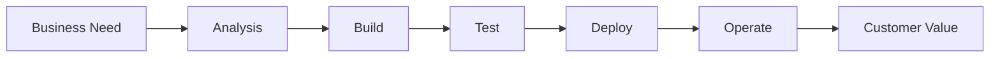
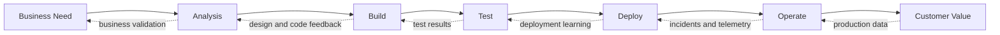
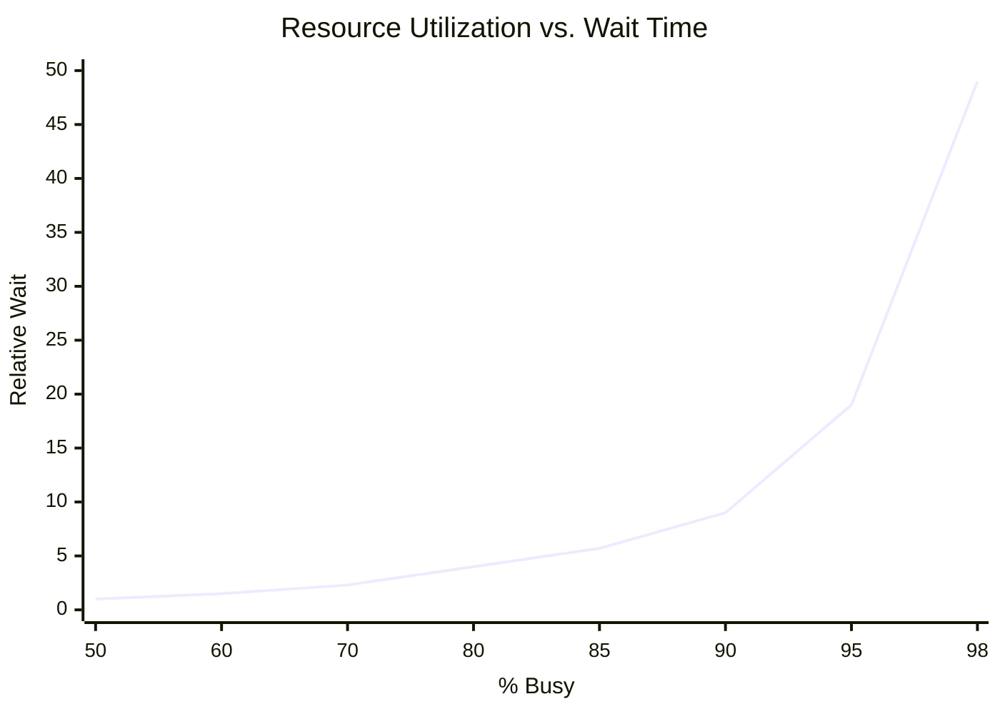
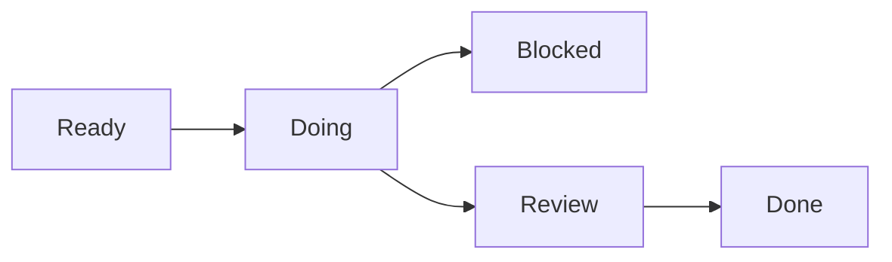
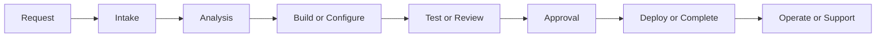
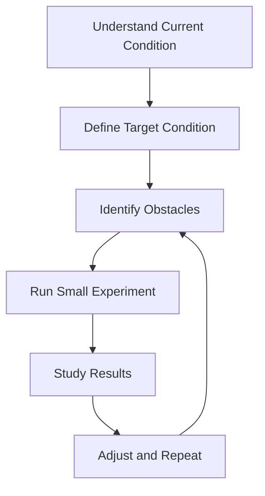

# The Phoenix Project Participant Study Guide v2.0

## 4-Week Brown-Bag Study Series

**Book:** *The Phoenix Project: A Novel About IT, DevOps, and Helping Your Business Win* by Gene Kim, Kevin Behr, and George Spafford  
**Companion Reference:** *The Phoenix Project Resource Guide*  
**Audience:** Project Managers, Product Owners, Developers, Business Analysts, Operations, Security, QA, Support, and Leaders  
**Format:** Four weekly 60-minute discussion sessions  
**Participant Goal:** Read, reflect, discuss, and identify one practical improvement you can apply in your role.

---

## What Changed in Version 2.0

Version 2.0 adds concepts from the Resource Guide section of *The Phoenix Project*:

- Why DevOps matters as a business capability, not only an IT practice.
- Clearer explanation of the Three Ways.
- Stronger emphasis on the Four Types of Work.
- More explicit treatment of WIP, queue time, and resource utilization.
- DevOps myth-busting: DevOps does not replace Agile, ITIL, Operations, or security.
- Stronger links to Continuous Delivery, Toyota Kata, Theory of Constraints, Visible Ops, and Kanban.
- More practical role-based exercises and 30-day improvement planning.

---

## How to Use This Guide

Use this guide while reading. Each week includes:

- Reading assignment
- Key concepts
- While-reading questions
- Brown-bag discussion topics
- Role-based reflection prompts
- A practical assignment

You do not need perfect answers. The purpose is to notice patterns and connect the story to your own work.

As you read, keep asking:

> Where have I seen this pattern before?

> How does this apply to my role?

> What could we make more visible, safer, faster, or easier to learn from?

---

## Course Reading Plan

| Week | Reading Assignment | Main Focus |
|---|---:|---|
| Week 1 | Chapters 1-10 | The mess, silos, invisible work, and the Four Types of Work |
| Week 2 | Chapters 11-20 | The First Way, bottlenecks, Theory of Constraints, WIP, and Kanban |
| Week 3 | Chapters 21-29 | The Second Way, feedback loops, Dev/Ops collaboration, security, and quality at the source |
| Week 4 | Chapters 30-35 | The Third Way, resilience, continual learning, and business alignment |

---

## The Big Idea

*The Phoenix Project* is not just a story about a failed IT project. It is a story about a broken system of work. The book shows how invisible work, unplanned work, overloaded specialists, poor handoffs, late feedback, low trust, and conflicting priorities can damage delivery, reliability, security, employee morale, and business outcomes.

The Resource Guide deepens this lesson by connecting the story to Lean, DevOps, Theory of Constraints, Continuous Delivery, Kanban, Visible Ops, and Toyota Kata.

---

# Core Concepts

## 1. DevOps as Business Capability

DevOps is not only automation, tools, or deployment pipelines. It is a way of improving the full IT value stream so business needs can become reliable customer value faster and safer.

In practical terms, DevOps improves:

- Feature time to market
- Customer satisfaction
- Reliability and stability
- Employee productivity and morale
- Recovery from incidents
- Ability to experiment and learn
- Alignment between business, development, operations, security, and support

Reflection:

> In your organization, is technology treated mostly as a cost center, service provider, or business value creator?

---

## 2. The Three Ways

### The First Way: Flow

The First Way is about the left-to-right flow of work from business need to customer value.

To improve flow:

- Use smaller batches of work.
- Limit work in progress.
- Reduce handoffs and waiting.
- Avoid passing defects downstream.
- Optimize for the whole system, not individual silos.
- Build environments and delivery paths that are safe to change.

Reflection:

> Where does work wait the longest before customer value is delivered?

---

### The Second Way: Feedback

The Second Way is about fast feedback from right to left across the value stream.

To improve feedback:

- Detect defects earlier.
- Use automated testing and monitoring.
- Share production telemetry.
- Stop the line when builds, tests, or deployments fail.
- Include Operations, Security, QA, and Support earlier.
- Feed incidents and support trends back into product and engineering.

Reflection:

> What problem in your role is usually discovered too late?

---

### The Third Way: Continual Learning and Experimentation

The Third Way is about creating a culture of learning, practice, experimentation, and resilience.

To improve learning:

- Treat failures as learning opportunities.
- Practice recovery before a crisis.
- Make improvement part of daily work.
- Create high-trust teams.
- Encourage safe experiments.
- Pay down technical debt and nonfunctional gaps.
- Practice until good behaviors become routine.

Reflection:

> Does your team have time to improve the system, or only time to survive the work?

---

## 3. The Four Types of Work

The book describes four types of IT work:

| Type | Description | Common Risk |
|---|---|---|
| Business Projects | Work tied to business initiatives, product releases, or strategic programs | Visible to leadership but often underestimates dependencies |
| Internal IT Projects | Infrastructure, upgrades, modernization, automation, platforms, resilience | Often invisible or underfunded |
| Changes | Updates to existing systems, releases, configuration changes, access changes | Can create incidents if poorly controlled |
| Unplanned Work | Incidents, outages, break-fixes, emergency requests, escalations, rework | Consumes capacity and blocks planned work |

Reflection:

> Which type of work consumes the most time in your role?

---

## 4. Why WIP and Queue Time Matter

One of the strongest lessons in the Resource Guide is that high utilization creates long wait times. When people or teams are loaded near 100%, even small tasks can sit in queue for days or weeks.

Key lesson:

> A 30-minute task is not a 30-minute lead time if it waits behind seven overloaded handoffs.

Reflection:

> Where does a small request in your organization take a long time because it is waiting in a queue?

---

## 5. DevOps Myth-Busting

| Myth | Better Understanding |
|---|---|
| DevOps replaces Agile | DevOps extends Agile by redefining “done” as running successfully in production. |
| DevOps replaces ITIL | DevOps and ITIL can work together; change, configuration, incident, and problem management still matter. |
| DevOps means NoOps | Operations does not disappear; many operational capabilities become automated, self-service, and shared. |
| DevOps is only for startups | Enterprise organizations need DevOps because they have complex dependencies, legacy systems, and high risk. |
| DevOps is just automation | Automation helps, but shared goals, shared pain, trust, flow, feedback, and learning matter just as much. |

Reflection:

> Which DevOps myth appears most often in your environment?

---

# Week 1: The Mess and the Four Types of Work

## Reading Assignment

Read **Chapters 1-10**.

## Focus

Bill Palmer is pushed into the VP of IT Operations role at Parts Unlimited. The organization is failing, Project Phoenix is in trouble, teams are siloed, and work is invisible.

## Learning Objectives

By the end of Week 1, you should be able to:

- Recognize symptoms of a siloed organization.
- Explain the Four Types of Work.
- Identify examples of unplanned work.
- Describe why hidden work damages delivery.
- Recognize hero culture and single points of failure.

## Key Concepts

- Invisible work
- Unplanned work
- Siloed teams
- Finger-pointing
- Hero culture
- Business vs. IT misalignment
- Four Types of Work

## While-Reading Questions

1. What are the initial symptoms of dysfunction between Development, IT Operations, Security, and the Business?
2. How does Bill initially react to his promotion, and why does he feel that way?
3. What work is visible to leadership, and what work is hidden?
4. What is Project Phoenix supposed to accomplish?
5. What happens when standard IT protocols are bypassed?
6. Who appears to be overloaded, and why?
7. Which types of work are planned, and which are unplanned?

## Brown-Bag Discussion Topics

### The Blame Game

How does finger-pointing between Dev, Ops, Security, and the Business mirror challenges we see in real organizations?

### Identifying Work

Use the Four Types of Work to categorize work from your own role.

| Work Item | Business Project | Internal IT Project | Change | Unplanned Work |
|---|---:|---:|---:|---:|
|  |  |  |  |  |
|  |  |  |  |  |
|  |  |  |  |  |

### The Cost of Unplanned Work

How does unplanned work act as “anti-work”? What planned work does it displace?

## Role-Based Reflection

### Project Manager

- Where does unplanned work disrupt your schedule?
- How do you account for hidden dependencies?
- What planned work is at risk because teams are overloaded?

### Product Owner

- Are priorities truly ranked, or are too many items considered urgent?
- Which backlog items create downstream operational work?
- What work should be stopped or delayed?

### Developer

- What interrupts focused build time?
- Where does undocumented knowledge create dependency on one person?
- Are heroics rewarded more than prevention?

### Business Analyst

- Where do unclear requirements create rework?
- Are support, security, and operational impacts captured early?
- What assumptions should be validated sooner?

### Operations / Infrastructure

- What work arrives late and urgent?
- Which recurring tasks should become standard, automated, or self-service?
- Where is supportability ignored until production?

### Security / Risk / Compliance

- Where is security brought in too late?
- What risks are created by emergency delivery?
- Which controls could be embedded earlier?

### Leader / Manager

- What important work is invisible in status reporting?
- Who are the single points of failure?
- What incentives reward firefighting instead of prevention?

## Week 1 Assignment

Write a one-page reflection:

> Where does my organization rely on heroics instead of reliable systems?

Include:

- One real or realistic example.
- The type of work involved.
- The impact on delivery, risk, quality, or morale.
- One way to make the work more visible.

---

# Week 2: The First Way, Constraints, WIP, and Kanban

## Reading Assignment

Read **Chapters 11-20**.

## Focus

Bill begins applying manufacturing and Lean principles to IT. The team learns about constraints, bottlenecks, WIP, Kanban, and the importance of protecting Brent.

## Learning Objectives

By the end of Week 2, you should be able to:

- Explain the First Way: Flow.
- Explain the Theory of Constraints.
- Describe why Brent is a bottleneck.
- Explain why high utilization increases queue time.
- Use a basic Kanban view to visualize work.
- Identify one bottleneck in your own workflow.

## Key Concepts

- First Way: Flow
- Theory of Constraints
- WIP limits
- Kanban
- Queue time
- Resource utilization
- Global optimization vs. local optimization
- Protecting the constraint

## Theory of Constraints: Five Steps

1. **Identify** the constraint.
2. **Exploit** the constraint by making sure it works only on the highest-value work that only it can do.
3. **Subordinate** other work to the constraint.
4. **Elevate** the constraint by increasing capacity or reducing demand.
5. **Repeat** the process because the constraint will move.

## Kanban Starter Model

Recommended starter rule:

> Limit the number of items in Doing before starting new work.

## While-Reading Questions

1. What is the Theory of Constraints as Erik explains it?
2. Who is the primary bottleneck at Parts Unlimited, and how did he become one?
3. What steps does Bill take to protect the bottleneck from unplanned work?
4. How does the Kanban board change the way the team views work?
5. What happens when all work must flow through one person?
6. How does high utilization create long queue time?
7. What work should be routed away from Brent?

## Brown-Bag Discussion Topics

### Find Your Brent

Brent is the indispensable engineer who slows everything down because too much work depends on him.

Discuss:

- Do we have “Brents” in our organization?
- Are they people, systems, tools, approval boards, environments, or vendors?
- How can we protect them?
- How can we share or reduce dependency on their knowledge?

### Visualizing Work

What tools do we use to visualize work? Are they effective? What work is missing from those tools?

### Flow and WIP

How could limiting work in progress improve delivery, quality, or morale?

## Week 2 Activity: Flow Map

Map one process from request to outcome.

Then mark:

- Where work waits.
- Where work is reworked.
- Where the same person or team is always needed.
- Where approvals happen.
- Where defects escape.
- Where work is invisible.

## Week 2 Assignment

Create a simple flow map for one process in your role.

Include:

1. Start point
2. End point
3. Major handoffs
4. Waiting points
5. Bottlenecks
6. One improvement idea

---

# Week 3: The Second Way, Feedback Loops, Quality, and Security

## Reading Assignment

Read **Chapters 21-29**.

## Focus

The organization begins improving feedback. Development and Operations become more collaborative. Security starts shifting from gatekeeper to partner. Batch sizes shrink, and work becomes safer.

## Learning Objectives

By the end of Week 3, you should be able to:

- Explain the Second Way: fast feedback.
- Describe why late feedback creates rework.
- Explain quality at the source.
- Describe how Security can become an enabler.
- Identify one delayed feedback loop in your own role.

## Key Concepts

- Second Way: Feedback
- Right-to-left learning
- Quality at the source
- Automated testing
- Production telemetry
- Smaller batch sizes
- Security shifting left
- Shared goals and shared pain

## While-Reading Questions

1. What is the core concept of the Second Way?
2. How do Chris and Bill begin to align their goals?
3. Why is reducing batch size safer than large, monolithic deployments?
4. How does John, the CISO, begin to change his approach?
5. What kinds of feedback were missing earlier in the book?
6. Where does the team learn too late?
7. What changes make work safer?

## Brown-Bag Discussion Topics

### DevOps Collaboration

How did the relationship between Development and Operations shift from adversarial to collaborative? What compromises were required?

### Feedback Loops

How quickly do we know if a change caused a downstream issue? How could we shorten that feedback loop?

### Security as an Enabler

How can security, quality assurance, compliance, or risk be integrated earlier instead of acting only as a final gate?

## Feedback Loop Worksheet

| Question | Response |
|---|---|
| What process are you reviewing? |  |
| Where do problems usually start? |  |
| Where are they discovered? |  |
| Who receives the feedback? |  |
| Who should receive the feedback earlier? |  |
| What feedback is too slow? |  |
| What can be automated, standardized, or made visible? |  |

## Week 3 Assignment

Write a one-page response:

> What problem in my role do we usually discover too late?

Include:

- Where the problem starts.
- Where it is discovered.
- Why feedback is delayed.
- What earlier feedback loop could help.

---

# Week 4: The Third Way, Learning, Resilience, and Business Alignment

## Reading Assignment

Read **Chapters 30-35**.

## Focus

The organization learns to improve the system of work. IT becomes more aligned to business value. The team practices resilience, learns from failure, and moves toward continual experimentation.

## Learning Objectives

By the end of Week 4, you should be able to:

- Explain the Third Way.
- Describe why repetition and practice create mastery.
- Explain why improvement work must be part of daily work.
- Connect DevOps to business outcomes.
- Create a realistic 30-day improvement proposal.

## Key Concepts

- Third Way: Continual learning and experimentation
- Toyota Kata
- Improvement cycles
- Resilience and Chaos Monkey-style learning
- Blameless postmortems
- Nonfunctional requirements
- Business alignment
- High-trust culture

## Improvement Kata Starter

## While-Reading Questions

1. What does the Third Way require regarding culture and experimentation?
2. What is the purpose of the Chaos Monkey exercise?
3. How does Steve Masters' view of IT change by the end of the novel?
4. How does the team save Parts Unlimited and Project Phoenix?
5. What behaviors show that the organization is learning?
6. What nonfunctional requirements become more important?
7. How does IT become a business partner instead of a scapegoat?

## Brown-Bag Discussion Topics

### Embracing Failure

The Third Way requires a culture where it is safe to fail and learn. Do we have a blameless culture when things go wrong?

### Building Resilience

Could we safely practice recovery from failures? What could we test in a low-risk way?

### Final Action Plan

What is one specific process change or cultural shift we should pitch to leadership to improve daily work?

## Week 4 Assignment

Create a **Phoenix Project Role Application Brief**.

Length: 1-2 pages.

Include:

1. Your role.
2. Three lessons from the book.
3. One problem in your organization that reflects the book.
4. One bottleneck or source of unplanned work.
5. One feedback loop that needs improvement.
6. One action you can personally take.
7. One recommendation for leadership.

---

# Final Capstone: 30-Day Improvement Proposal

Each participant or small group creates a short proposal.

## Proposal Template

### Problem Statement

Describe one recurring problem that affects flow, quality, risk, reliability, morale, or delivery.

### Current Impact

Explain how the problem affects time, cost, quality, morale, customer experience, or risk.

### Book Connection

Identify the related lesson from *The Phoenix Project*.

Possible connections:

- Four Types of Work
- Unplanned work
- Brent bottleneck
- First Way: Flow
- Second Way: Feedback
- Third Way: Learning
- Theory of Constraints
- WIP limits
- Security shifting left
- Continuous delivery
- Toyota Kata

### Root Cause

Explain why the issue keeps happening.

### Proposed 30-Day Experiment

Describe one small, realistic change that can be tested in 30 days.

### Expected Outcome

Explain what should improve.

### Measurement

Pick one or two simple indicators.

Examples:

- Fewer emergency requests
- Reduced approval wait time
- Fewer reopened defects
- Faster incident recovery
- Reduced blocked work
- More work visible in the backlog
- Fewer late security findings
- Improved deployment success

## Example Proposal Ideas

- Add operational readiness questions to project intake.
- Add access planning to release readiness.
- Add security control requirements to the design template.
- Create a WIP limit for active project work.
- Build a simple Kanban board for team requests.
- Create a recurring review of unplanned work.
- Document a process currently dependent on one expert.
- Add a standard rollback question to change review.
- Add production telemetry requirements to acceptance criteria.
- Feed support ticket trends back into sprint planning.

---

# Final Reflection Questions

1. What part of the book felt most familiar?
2. Who or what is the “Brent” in our organization?
3. What type of unplanned work consumes the most time?
4. Where do we have too much work in progress?
5. What do we discover too late?
6. What process creates the most rework?
7. What is one improvement we could test in 30 days?
8. What would leadership need to support?
9. What should we stop doing?
10. What should we make visible?
