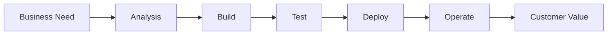
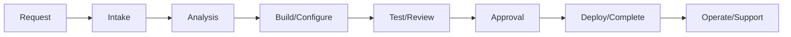
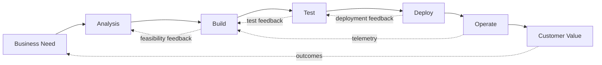
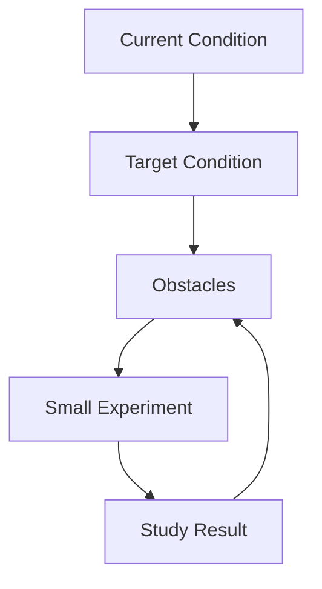

# The Phoenix Project Teacher / Proctor Guide v2.0

## 4-Week Brown-Bag Study Series

**Book:** *The Phoenix Project: A Novel About IT, DevOps, and Helping Your Business Win* by Gene Kim, Kevin Behr, and George Spafford  
**Companion Reference:** *The Phoenix Project Resource Guide*  
**Audience:** Project Managers, Product Owners, Developers, Business Analysts, Operations, Security, QA, Support, and Leaders  
**Format:** Four weekly 60-minute brown-bag sessions  
**Primary Outcome:** Participants connect the story to their own work system and identify one practical 30-day improvement.

---

## What Changed in Version 2.0

Version 2.0 incorporates the Resource Guide’s deeper treatment of:

- DevOps as a business performance capability.
- The Three Ways as guiding values, not just vocabulary.
- The Four Types of Work as a visibility and capacity-management tool.
- Resource utilization, WIP, queue time, and why small work can wait for weeks.
- DevOps myths, especially the misunderstandings that DevOps replaces Agile, ITIL, Operations, or governance.
- Continuous Delivery, Toyota Kata, Theory of Constraints, Kanban, and Visible Ops as supporting frameworks.
- More explicit facilitator prompts for security, risk, compliance, operations, and leadership.

---

## Facilitator Purpose

The facilitator is not expected to lecture through the book chapter by chapter. The goal is to help participants recognize organizational patterns and apply the lessons to their role.

The core shift you are guiding is:

> From: “That happened in the book.”  
> To: “That happens in our organization, and here is what we can improve.”

Use the book as a mirror for common enterprise problems:

- Invisible work
- Unplanned work
- Conflicting priorities
- Bottlenecks and hero culture
- Poor handoffs
- Late security, quality, and operational input
- Weak feedback loops
- Lack of shared business context
- Firefighting instead of continuous improvement
- High utilization that creates long queues
- Local optimization that harms global outcomes

---

## Facilitation Principle

Do not let the class turn into a complaint session. Convert complaints into system observations.

| Complaint Language | Facilitator Reframe |
|---|---|
| “Security always blocks us.” | “Where should security input happen earlier so it prevents rework?” |
| “Operations slows everything down.” | “What does Operations need earlier to support the change safely?” |
| “Developers throw things over the wall.” | “What incentives or handoffs make that behavior likely?” |
| “The PMO just wants dates.” | “What visibility would help planning reflect real capacity?” |
| “Everything is urgent.” | “Who is deciding priority, and what work should be stopped?” |

---

## Course Overview

### Course Goal

Participants will understand DevOps principles, identify dysfunctions in traditional IT environments, and learn how Lean manufacturing concepts apply to knowledge work.

### Reading Plan

| Week | Reading Assignment | Main Focus |
|---|---:|---|
| Week 1 | Chapters 1-10 | The mess, silos, invisible work, and the Four Types of Work |
| Week 2 | Chapters 11-20 | The First Way, bottlenecks, Theory of Constraints, WIP, and Kanban |
| Week 3 | Chapters 21-29 | The Second Way, feedback loops, Dev/Ops collaboration, and security shifting left |
| Week 4 | Chapters 30-35 | The Third Way, resilience, continual learning, and business alignment |

---

## Recommended 60-Minute Session Structure

| Time | Activity |
|---:|---|
| 0-5 min | Welcome, objective, and opening question |
| 5-15 min | Reading recap and key scenes |
| 15-25 min | Concept teaching |
| 25-45 min | Group activity or worksheet |
| 45-55 min | Role-based discussion and share-out |
| 55-60 min | Assignment, next reading, and close |

---

## Ground Rules

Read these aloud in Week 1.

1. Discuss systems, not personalities.
2. Use real examples, but protect confidentiality.
3. Challenge assumptions respectfully.
4. Avoid blame; look for conditions that create behavior.
5. Focus on changes within influence.
6. Convert frustrations into problem statements.
7. End each session with one practical takeaway.

---

## Teacher Notes: Resource Guide Concepts to Weave Throughout

### DevOps as Business Performance

DevOps is not just a technology movement. It improves the organization’s ability to deliver customer value safely and quickly. Emphasize business language: lead time, reliability, productivity, market responsiveness, risk, recovery, and customer outcomes.

Facilitator question:

> What business outcome is harmed when this work system breaks?

### The Three Ways

Use the Three Ways as the spine of the course:

1. **Flow:** How does work move from business need to customer value?
2. **Feedback:** How quickly do we learn when something is wrong?
3. **Learning:** How do we improve the system and practice resilience?

### The Four Types of Work

The Four Types of Work are a practical way to reveal demand and capacity.

- Business projects
- Internal IT projects
- Changes
- Unplanned work

Facilitator warning:

> If participants only list official project work, push them to identify support work, emergency work, access work, review work, escalations, meetings, rework, and interruptions.

### WIP, Queue Time, and Utilization

The Resource Guide’s queue-time lesson is powerful for teaching. Once resources are highly utilized, wait time rises sharply. A simple task can take days because it waits in queues across multiple teams.

Use this teaching statement:

> A 30-minute task can have a 2-week lead time if it crosses several overloaded teams.

### DevOps Myth-Busting

When participants misunderstand DevOps, clarify:

- DevOps does not replace Agile; it extends the definition of done to production success.
- DevOps does not replace ITIL; it often automates and improves ITIL processes.
- DevOps does not mean NoOps; Operations capabilities become more embedded and self-service.
- DevOps is not just automation; it also requires shared goals, trust, feedback, and learning.
- DevOps is not only for startups; enterprises often need it more because of scale, complexity, and risk.

---

# Week 1 Facilitator Guide

## Theme

The mess, silos, invisible work, and the Four Types of Work.

## Reading Assignment

Chapters **1-10**.

## Session Goal

Help participants recognize dysfunction without blaming individuals. They should see how invisible work, unplanned work, unclear ownership, and hero culture create system failure.

## Opening Question

> What scene from the first ten chapters felt most familiar to your work environment?

## Key Teaching Points

### 1. The Problem Is the System of Work

People are busy and trying hard, yet the system still fails. This is the foundation for the whole course.

Emphasize:

- Busy does not equal effective.
- Urgency can hide poor prioritization.
- Invisible work still consumes capacity.
- Unplanned work steals time from planned work.
- Local teams may optimize their own goals while harming the enterprise.

### 2. The Four Types of Work Reveal Capacity

Ask participants to categorize work, not just projects. Many organizations only manage official project demand while ignoring internal work, changes, and unplanned work.

### 3. Hero Culture Creates Fragility

A hero may save the day, but dependency on heroes means the system is unhealthy.

## Activity: Map the Work

Ask participants to list work from the last two weeks and categorize it.

| Work Item | Type | Planned or Unplanned? | Who Requested It? | Who Was Impacted? |
|---|---|---|---|---|
|  | Business Project / Internal IT / Change / Unplanned |  |  |  |

## Discussion Prompts

- What work was not visible in planning?
- What work interrupted planned priorities?
- Which work created rework?
- Which work depended on one person?
- What work had business impact but was treated as “just IT”? 

## Role-Based Prompts

- **PM:** Where does your plan assume more capacity than actually exists?
- **PO:** How do competing priorities enter the backlog?
- **Developer:** What interrupts focused work most often?
- **BA:** Where do unclear requirements create downstream rework?
- **Ops:** What work arrives late and urgent?
- **Security:** Where are controls discovered after design decisions are already made?
- **Leader:** What important work is missing from dashboards or reports?

## Common Misunderstandings

| Misunderstanding | Correction |
|---|---|
| “The problem is bad people.” | The book is showing a bad system producing predictable behavior. |
| “We just need better communication.” | Communication problems usually point to unclear flow, ownership, or feedback. |
| “Unplanned work is unavoidable.” | Some is unavoidable, but repeated unplanned work is a signal to improve the system. |

## Close

Ask each participant to write one sentence:

> One type of work we do not make visible enough is ______.

---

# Week 2 Facilitator Guide

## Theme

The First Way, constraints, WIP, queue time, and Kanban.

## Reading Assignment

Chapters **11-20**.

## Session Goal

Help participants understand that flow improves when work is visible, WIP is limited, and constraints are protected.

## Opening Question

> What changed once Bill’s team started making work visible?

## Key Teaching Points

### 1. The First Way: Flow

Flow is about moving work from left to right: business need to customer value.

### 2. Theory of Constraints

Teach the five steps:

1. Identify the constraint.
2. Exploit the constraint.
3. Subordinate all other work to the constraint.
4. Elevate the constraint.
5. Repeat because the constraint will move.

### 3. Brent Is a Constraint, Not Just a Person

Participants may focus on Brent as an individual. Redirect them to what Brent represents:

- Concentrated knowledge
- Undocumented systems
- Poor intake
- Escalation culture
- Overloaded specialist capacity
- Work that bypasses normal prioritization

### 4. High Utilization Creates Long Queues

Use this teaching statement:

> The more overloaded a person or team is, the longer every new request waits. Full utilization looks efficient locally but creates system-wide delay.

## Activity: Find the Constraint

Ask participants to map one workflow.

Mark:

- Queue points
- Rework points
- Overloaded teams
- Approval gates
- Hidden handoffs
- Late security or operational input

## Discussion Prompts

- Where does work wait?
- Where does it get reworked?
- Which person, team, tool, or vendor is the constraint?
- What work should be routed away from the constraint?
- What WIP limit could help?

## Role-Based Prompts

- **PM:** What dependency most often delays your project?
- **PO:** What work should be deprioritized to improve flow?
- **Developer:** What creates the most waiting time?
- **BA:** Where do requirements wait for clarification?
- **Ops:** Which recurring requests should be self-service?
- **Security:** Which controls can be standardized?
- **Leader:** What work needs to stop so the most important work can finish?

## Common Misunderstandings

| Misunderstanding | Correction |
|---|---|
| “The answer is to hire more people.” | First understand the constraint. More people can add more coordination cost. |
| “Everyone should be fully utilized.” | Full utilization creates queues and delays. Slack is necessary for flow and improvement. |
| “Kanban is just a task board.” | Kanban is a visibility and WIP-control system. |

## Close

Ask each participant to complete:

> Our likely constraint is ______ because ______.

---

# Week 3 Facilitator Guide

## Theme

The Second Way, feedback loops, quality at the source, security, and shared goals.

## Reading Assignment

Chapters **21-29**.

## Session Goal

Help participants identify delayed feedback and redesign work so problems are detected earlier.

## Opening Question

> Where in your work do problems get discovered later than they should?

## Key Teaching Points

### 1. The Second Way: Feedback

Feedback moves right to left so earlier work can improve.

### 2. Quality at the Source

Quality cannot be inspected only at the end. It must be built in through requirements, design, coding, testing, deployment, monitoring, and support.

### 3. Security as an Enabler

Security improves flow when it provides earlier input, reusable standards, automated checks, and clear risk guidance.

### 4. Shared Goals and Shared Pain

Development, Operations, Security, QA, and Support improve when they share outcomes instead of optimizing separately.

## Activity: Feedback Loop Review

| Question | Response |
|---|---|
| What process are we reviewing? |  |
| Where do problems usually start? |  |
| Where are they discovered? |  |
| Who receives feedback? |  |
| Who needs feedback earlier? |  |
| What feedback is too slow? |  |
| What can be automated or standardized? |  |

## Discussion Prompts

- What do we discover too late?
- Which feedback comes from customers, incidents, telemetry, support, QA, security, or audit?
- What feedback is ignored?
- What manual review could become an automated check?
- What requirement should be added earlier?

## Role-Based Prompts

- **PM:** Where should feedback checkpoints be added to the plan?
- **PO:** How do you know a feature solved the business problem?
- **Developer:** What test or review would catch issues earlier?
- **BA:** What requirement questions would prevent rework?
- **Ops:** What production signals should feed back into design?
- **Security:** What controls can become patterns or automated checks?
- **QA:** Which defect pattern keeps repeating?
- **Support:** Which recurring tickets should influence product decisions?

## Common Misunderstandings

| Misunderstanding | Correction |
|---|---|
| “Feedback means more meetings.” | Good feedback can be automated, visual, asynchronous, or embedded in workflow. |
| “Security must be a final gate.” | Some gates may remain, but earlier design guidance reduces late rework. |
| “Incidents mean someone failed.” | Incidents reveal system weaknesses and opportunities for learning. |

## Close

Ask each participant to complete:

> One thing we discover too late is ______. An earlier feedback loop could be ______.

---

# Week 4 Facilitator Guide

## Theme

The Third Way, continual learning, resilience, Toyota Kata, and business alignment.

## Reading Assignment

Chapters **30-35**.

## Session Goal

Help participants synthesize the book and create practical 30-day improvement proposals.

## Opening Question

> What is one behavior that changed by the end of the book?

## Key Teaching Points

### 1. The Third Way: Learning and Experimentation

The Third Way is about building a culture where teams can experiment, learn from failure, practice recovery, and improve continuously.

### 2. Toyota Kata

Toyota Kata is useful because it turns improvement into a practiced routine, not an annual workshop.

### 3. Chaos Monkey and Resilience

Chaos Monkey-style thinking means practicing failure in controlled ways so teams can recover safely during real incidents.

### 4. Nonfunctional Requirements Are Business Requirements

Reliability, security, operability, scalability, maintainability, and recoverability are not side issues. They determine whether business value survives contact with production.

## Activity: 30-Day Improvement Proposal

Have participants complete the template.

| Area | Response |
|---|---|
| My role |  |
| Recurring problem |  |
| Book concept |  |
| Root cause |  |
| People impacted |  |
| 30-day experiment |  |
| Support needed |  |
| Success measure |  |

## Discussion Prompts

- What improvement can be tested without waiting for a major transformation?
- What small change would reduce unplanned work?
- What could improve flow?
- What feedback could be faster?
- What practice would build resilience?
- What should leadership support?

## Role-Based Prompts

- **PM:** How can planning reflect real capacity and hidden work?
- **PO:** What can be deprioritized to protect flow?
- **Developer:** What technical debt creates repeated pain?
- **BA:** What discovery question should become standard?
- **Ops:** What manual task should be automated or standardized?
- **Security:** What control can shift left?
- **Leader:** What behavior should be rewarded to reduce firefighting?

## Common Misunderstandings

| Misunderstanding | Correction |
|---|---|
| “Continuous improvement requires a big program.” | Start with small experiments and regular learning cycles. |
| “Failure practice is too risky.” | Practice safely in controlled, low-risk environments first. |
| “Culture change is abstract.” | Culture changes when repeated behaviors, incentives, and management routines change. |

## Close

Each participant shares a 2-minute improvement pitch:

1. Problem
2. Book concept
3. 30-day experiment
4. Success measure

---

# Evaluation Approach

This course should be evaluated through participation, reflection, and practical application rather than a traditional exam.

## Suggested Evaluation Categories

| Category | Weight |
|---|---:|
| Reading completion | 20% |
| Weekly participation | 25% |
| Reflection assignments | 25% |
| Final role application brief | 15% |
| 30-day improvement proposal | 15% |

## Capstone Rubric

| Criteria | Strong | Acceptable | Needs Improvement |
|---|---|---|---|
| Problem clarity | Specific, real, well-defined | Understandable but broad | Vague or generic |
| Book connection | Clearly tied to flow, feedback, constraints, work types, or learning | Some connection | Weak or missing |
| Role application | Directly connected to participant’s role | Somewhat connected | Not role-specific |
| Practicality | Can be tested in 30 days | Possible with refinement | Too broad or unrealistic |
| Measurement | Has simple success indicators | General expected outcome | No measurement |
| Systems thinking | Addresses root cause or process condition | Addresses symptoms somewhat | Focuses on blame only |

---

# Facilitator Phrases

## Starting the Course

> This study is not about proving whether our organization is good or bad. It is about using the book as a mirror. We are looking for patterns: hidden work, bottlenecks, unclear priorities, late feedback, and hero culture.

## Redirecting Blame

> Let’s step back from the person or team and look at the system condition that makes that behavior likely.

## Making Answers More Specific

> Can you give one example where that happened?

## Moving Toward Action

> What is the smallest version of that improvement we could test in 30 days?

## Connecting to Business Value

> How does this issue affect speed, quality, risk, customer experience, cost, or employee morale?

---

# Optional Knowledge Checks

## Week 1

1. What are the Four Types of Work?
2. Why is unplanned work so damaging?
3. What is hero culture?
4. What work is often invisible to leadership?

## Week 2

1. What is the First Way?
2. What are the five Theory of Constraints steps?
3. Why does high utilization create long queues?
4. How does Kanban help manage WIP?

## Week 3

1. What is the Second Way?
2. What does quality at the source mean?
3. How can security shift left?
4. What is one example of useful production feedback?

## Week 4

1. What is the Third Way?
2. How does Toyota Kata support continuous improvement?
3. Why are nonfunctional requirements business requirements?
4. What makes a good 30-day improvement proposal?

---

# Final Facilitator Debrief

After the final session, summarize:

- Common sources of unplanned work
- Major bottlenecks or constraints
- Missing feedback loops
- Repeated security, quality, or operational late-stage findings
- Candidate 30-day improvement experiments
- Leadership recommendations

Suggested final output:

> A small improvement backlog based on participant proposals.

---

# Closing Statement

> The Phoenix Project is not really a story about one failed IT project. It is a story about how organizations create chaos when work is invisible, priorities are unclear, feedback is slow, and learning is sacrificed for urgency. The value of this study is whether we can now see our own work system more clearly and improve one part of it from where we sit.
